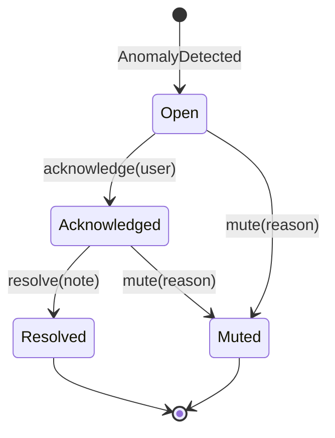

# Design & Testing Document — DataOps Copilot

> Living document required by the Capstone handbook. Keep in sync with code via `/docs-sync`.
> Sections marked TODO are filled during the sprints; never claim results that do not exist.

## 1. Overview
Problem, personas and scope: see `PRD.md`. Deployed app: TODO URL. Task board: TODO URL.

## 2. Architecture
### 2.1 Style and rationale
Modular monolith with Ports & Adapters (hexagonal), organised by DDD bounded contexts. Chosen with
the course heuristic: a monolith is acceptable at this scale and team size (1 developer, 6 days,
free-tier hosting); business logic must not depend on infrastructure, hence Ports & Adapters.
Microservices were rejected for the MVP (operational overhead, cold starts on free tier) but the
event-driven seams make extraction of `detection` and `copilot` into services straightforward
(Strangler Fig). See ADR-0001.

### 2.2 Bounded contexts (DDD)
| Context | Subdomain type | Responsibility |
|---|---|---|
| ingestion | supporting | validate and persist pipeline runs, publish `RunIngested` |
| monitoring | supporting | read models for dashboard, SLA status, metrics |
| incidents | **core** | detectors, alert aggregate & state machine, risk model |
| copilot | **core** | retrieval, prompting, explanations, test suggestions, AI safety |
| simulator | generic (dev/demo) | synthetic platform and chaos scenarios |

### 2.3 Diagrams (Mermaid)
TODO: use-case diagram, component diagram, class diagram (Alert aggregate), sequence diagram
(chaos scenario -> alert -> explain), state-machine diagram (Alert), ERD, deployment diagram.

### 2.4 Patterns used and why
| Pattern | Where | Why |
|---|---|---|
| Ports & Adapters | `*/ports.py`, `*/repository.py`, `copilot/llm.py` | swap DB/LLM without touching domain; testable with fakes |
| Domain Model + Aggregate root | `incidents/domain.py` (Alert) | enforce valid transitions and audit in one place |
| State machine | Alert lifecycle | illegal transitions are impossible by construction |
| Strategy | detectors, LLM/embedding providers | add a detector/provider without modifying callers (Open-Closed) |
| Observer / event-driven | `shared/events.py` | decouple ingestion from detection and notification |
| Repository | each context | persistence ignorance for domain code |
| CQRS-lite | SQL views for dashboard | fast reads, simple writes |
| Adapter | ingest payload formats (Airflow-like, dbt-like) | normalise external formats |
| Template Method/Prompt template | copilot prompts | consistent, auditable prompts |

### 2.5 Technology choices
TODO with reasons: FastAPI, Jinja2+HTMX+Chart.js (ADR-0002), Postgres+pgvector (ADR-0003),
LLM adapter + fallback (ADR-0004), scikit-learn, GitHub Actions, Docker, Render.

### 2.6 Data model
TODO ERD + normalisation notes (3NF), constraints (CHECK rows_loaded >= 0, UNIQUE run_id, FKs).

### 2.7 AI/ML design
TODO: features, split, scaling without leakage, model comparison table (LR vs RF), metrics;
RAG pipeline (load -> chunk -> embed -> store -> retrieve top-k -> prompt -> cite), chunking
strategy, eval set and hit rate; prompt-injection defences; fallback behaviour; inference cost.

## 3. Deployment options and cost
| Option | What | Est. monthly cost | Pros | Cons |
|---|---|---|---|---|
| Render free + Neon free (MVP) | 1 web service + managed Postgres | ~$0 + LLM usage | zero cost, simple | cold starts, limits |
| Render paid / Railway | always-on instance | low tens of USD | no cold start | still single instance |
| AWS ECS Fargate + RDS + ALB | containers, managed DB | ~tens-100+ USD | scalable, multi-AZ | more ops, cost |
| AWS EKS | Kubernetes | 100+ USD (control plane + nodes) | needed only for many services | overkill for MVP |
| On-premises VM | Docker on company server | CAPEX + ops time | data stays inside | patching, scaling, TCO |
TODO: verify current prices before submission; recommend option and justify (Well-Architected pillars).

## 4. Testing
### 4.1 Strategy
Test pyramid, TDD per story (AAA), deterministic fakes for clock/LLM, seeded simulator.
### 4.2 Inventory (update with real counts)
| Type | Tool | What it proves | Count | Status |
|---|---|---|---|---|
| Unit | pytest | domain rules, detectors, state machine | TODO | |
| Integration | pytest + Postgres | repositories, API endpoints, events | TODO | |
| ML quality gate | pytest | recall >= 0.70, no leakage | TODO | |
| RAG evaluation | script | hit rate@3 >= 0.8 | TODO | |
| AI safety | pytest | prompt-injection logs neutralised | TODO | |
| E2E | Playwright | chaos -> alert -> explain -> resolve | TODO | |
| Performance | Locust | ingest p95 < 300 ms @ 20 rps | TODO | |
| SAST | bandit | no high-severity issues | TODO | |
| DAST | OWASP ZAP baseline | no high-risk findings | TODO | |
| Smoke | curl `/health` after deploy | deployment works | TODO | |
### 4.3 Coverage
TODO latest %.

## 5. CI/CD
TODO: workflow stages, branch protection, PR template, deployment trigger, rollback approach.

## 6. Agile process
Board link, sprint log, stand-ups, sprint demo recordings, retrospectives.

## 7. Ethics, security, AI usage
Synthetic data, least privilege, AI disclosure; how AI tools were used in development: `ai-usage.md`.

## 8. Known gaps and future work
TODO
